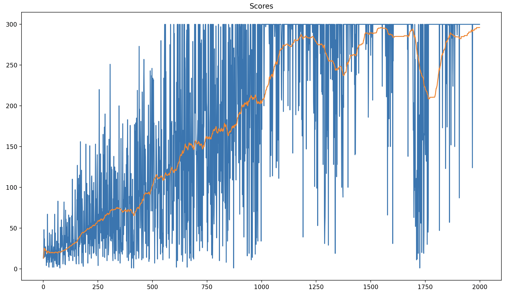

# reinforcement-learning

This repository contains code for a SARSA reinforcement learning agent using
tiled Q-tables for solving the
[Cart Pole problem](https://www.gymlibrary.dev/environments/classic_control/cart_pole/).

### Getting started

The agent can be run with Python. Follow the below steps to get started.

##### Create a virtual environment and install dependencies

It is recommended to create a Python virtual environment when installing the
dependencies. This can be done as follows:

```sh
python3 -m venv env
```

Then, activate the virtual environment

```sh
source env/bin/activate
```

Finally, install the requirements from `requirements.txt`:

```sh
pip install -r requirements.txt
```

### Run the agent

The entrypoint of the program is in `main.py`. This is also where all parameters
are kept. Feel free to change these in order to achieve as good results as
possible.

To start the agent, run the following command:

```sh
python main.py
```

This will output the maximum score reached every 100th iteration. When the
training terminates, the score for each iteration is plotted.


